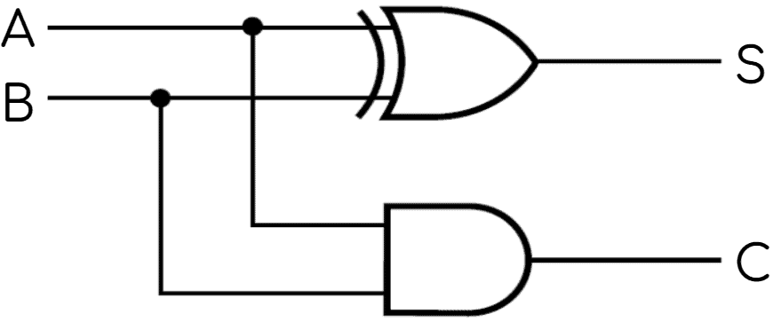
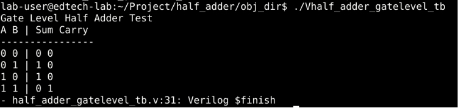
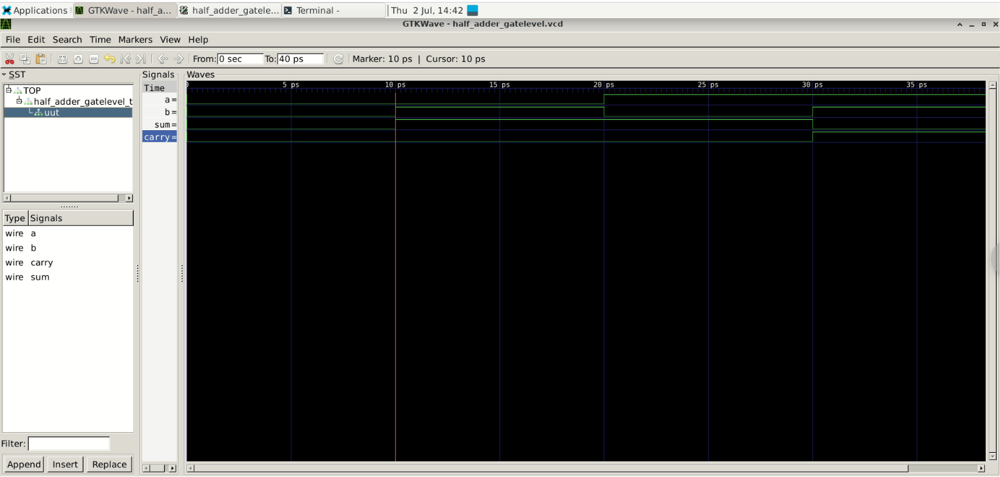

# Half Adder in Verilog

## Overview

This project implements a **Half Adder** using three different Verilog modeling styles:

* Gate-Level Modeling
* Dataflow Modeling
* Behavioral Modeling

A Half Adder is a combinational logic circuit that adds two single-bit binary numbers and produces a **Sum** and a **Carry** output.

---

## Truth Table

|  A  |  B  | Sum | Carry |
| :-: | :-: | :-: | :---: |
|  0  |  0  |  0  |   0   |
|  0  |  1  |  1  |   0   |
|  1  |  0  |  1  |   0   |
|  1  |  1  |  0  |   1   |

---
## Circuit Implementation

## Logic Equations

**Sum**

```
Sum = A ⊕ B
```

**Carry**

```
Carry = A · B
```

---

## Project Structure

```text
Half_Adder/
│── half_adder_gatelevel.v
│── half_adder_dataflow.v
│── half_adder_behavioral.v
│── half_adder_tb.v
│── README.md
```

---

## Modeling Styles

### 1. Gate-Level Modeling

Implements the Half Adder using Verilog primitive gates.

* XOR gate for Sum
* AND gate for Carry

---

### 2. Dataflow Modeling

Implements the Half Adder using continuous assignment statements.

```verilog
assign sum = a ^ b;
assign carry = a & b;
```

---

### 3. Behavioral Modeling

Implements the Half Adder using an `always` block.

```verilog
always @(*) begin
    sum = a ^ b;
    carry = a & b;
end
```

---

## Testbench

The project includes a common testbench that verifies all four possible input combinations.

Test Cases:

|  A  |  B  |
| :-: | :-: |
|  0  |  0  |
|  0  |  1  |
|  1  |  0  |
|  1  |  1  |

---

## Expected Output


---

## Simulation

Compile the design along with the testbench and run the simulation.

The waveform file generated:

```text
half_adder_gatelevel.vcd
```


This waveform can be viewed using **GTKWave**.

---

## Applications

* Binary Addition
* Arithmetic Logic Units (ALUs)
* Digital Arithmetic Circuits
* Computer Architecture
* Processor Design

---

## Learning Outcomes

Through this project, the following concepts are demonstrated:

* Verilog HDL syntax
* Gate-Level Modeling
* Dataflow Modeling
* Behavioral Modeling
* Testbench Development
* Digital Logic Simulation
* Waveform Analysis

---

## Author

**Kalimuthu Keerthika**

